# Desktop2Stereo: a 2D Desktop to 3D Stereo App
[中文版本](./readmeCN.md)   

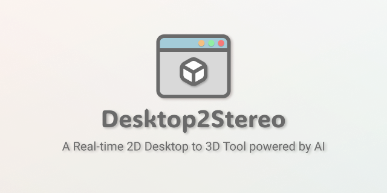   
A universal real-time 2D to 3D App that supports AMD/NVIDIA/Intel/Qualcomm GPU/Apple Silicon devices on Windows/Mac/Ubuntu, powered by Depth Estimation AI Models
## Alternative Download Link
[Quark NetDrive](https://pan.quark.cn/s/9d2bcf039b96)  
Access code: `1vcn`  
## Video Tutorials  
- [Windows](https://space.bilibili.com/156928642/lists/6783964)  
- [MacOS](https://space.bilibili.com/156928642/lists/6783943) 
- [Ubuntu](https://space.bilibili.com/156928642/lists/6790009) 
## Supported Hardware  
1. AMD GPU  
2. NVIDIA GPU  
3. Apple Silicon Chip (M1, M2, M3, M4, ...)  
4. Other DirectML devices (Intel Arc/Iris GPU, Qualcomm® Adreno GPU, etc. **Windows** Only)
## Supported OS  
1. Windows 10/11 (x64/Arm64)
2. MacOS 10.16 or later  
3. Ubuntu 22.04 or later  
## Preparation and Installation
### Windows  
1. Install latest GPU driver  
    **AMD GPU**:  
        - `Windows`： Recommend to download the 25.9.2 driver for stable ROCm7 performance: [AMD Software: Adrenalin Edition 25.9.2 Windows Download](https://drivers.amd.com/drivers/amd-software-adrenalin-edition-25.9.2-win10-win11-sep-rdna.exe).  
        - `Ubuntu`： Download latest GPU driver from [AMD Drivers and Support for Processors and Graphics](https://www.amd.com/en/support/download/drivers.html).  
    **NVIDIA GPU**: Download latest GPU driver from [NVIDIA Official GeForce Drivers](https://www.nvidia.com/en-us/geforce/drivers/).  
    **Intel GPU**: Download latest GPU driver from [Download Intel Drivers and Software](https://www.intel.com/content/www/us/en/download-center/home.html/).  
    **Qualcomm GPU**: Download latest GPU driver from [Qualcomm® Adreno™ Windows Graphics Drivers for Snapdragon® X Platform](https://softwarecenter.qualcomm.com/catalog/item/Windows_Graphics_Driver).  
    **Other DirectML devices**: Please install the latest hardware driver accordingly.  
2. Install Microsoft Visual C++ Redistributable
    Download [Visual Studio 2017–2026 C++ Redistributable] (https://learn.microsoft.com/en-us/cpp/windows/latest-supported-vc-redist?view=msvc-170#latest-supported-redistributable-version) and install (restart Windows).   
3. Enable Long Path
    Double click the `long_path.reg` in the **Desktop2Stereo** folder and confirm the warning. 
4. Deploy Desktop2Stereo Environment  
- **Method 1 (Recommended)**: Use Portable Version   
    Download: [Quark NetDrive](https://pan.quark.cn/s/9d2bcf039b96) (Access code: `1vcn`)  
        **AMD 7000/9000/Ryzen AI (Max)/etc. Series GPUs with ROCm7 Support**: Portable Version is not available due to special deployment process, please refer to **Method2**.  
        **Older AMD/Intel/Qualcomm GPU and other DirectML devies**: Download and unzip the `Desktop2Stereo_vX.X.X_AMD_etc_Windows.zip` to local disk.  
        **NVIDIA GPU**: Download and unzip `Desktop2Stereo_vX.X.X_NVIDIA_Windows.zip` to local disk.  
- **Method 2**: Manual Deployment with embeded Python
    1. Download and unzip `Desktop2Stereo_vX.X.X_Python311_Windows.zip` to local disk.  
    2. Install Python environment  
        **AMD 7000/9000/Ryzen AI (Max)/etc. Series GPUs with ROCm7 Support**: Doulbe click `install-rocm7_standalone.bat`. (Check comaptibility here: [https://rocm.docs.amd.com/en/latest/compatibility/compatibility-matrix.html](https://rocm.docs.amd.com/en/latest/compatibility/compatibility-matrix.html))  
        **Older AMD/Intel/Qualcomm GPU and other DirectML devies**: Doulbe click `install-dml_standalone.bat`.   
    **NVIDIA GPU**: Doulbe click `install-cuda_standalone.bat`.
- **Method 3**: Manual Deployment with system Python
    1. Install **Python 3.11**  
        Download from [Python.org](https://www.python.org/ftp/python/3.10.11/python-3.10.11-amd64.exe) and install.  
    2. Download Desktop2Stereo app  
        Download the [Desktop2Stereo.zip](https://github.com/lc700x/desktop2stereo/releases/latest) and unzip it to local disk.  
    3. Install Python environment  
        **AMD 7000/9000Ryzen AI (Max)/etc. Series GPUs with ROCm7 Support**: Doulbe click `install-rocm7.bat`. 
        **Older AMD/Intel/Qualcomm GPU and other DirectML devies**: Doulbe click `install-dml.bat`.  
        **NVIDIA GPU**: Doulbe click `install-cuda.bat`.  
### MacOS 
1. Install **Python 3.11**  
    Download from [Python.org](https://www.python.org/ftp/python/3.10.11/python-3.10.11-macos11.pkg) and install.  
2. Download Desktop2Stereo app  
    Download the [Desktop2Stereo.zip](https://github.com/lc700x/desktop2stereo/releases/latest) and unzip it to local disk.  
3. Install Python environment  
    Doulbe click `install-mps` executable. (Please allow open in **Privacy and Security Settings**)，if you cannot run the executable, please do the folloing first:
    ```bash
    chmod a+x install-mps
    chmod a+x run_mac
    chmod a+x update_mac_linux
    ```
### Ubuntu
1. Install latest GPU driver  
    **AMD GPU**: Download latest GPU driver and ROCm from [AMD Drivers and Support for Processors and Graphics](https://www.amd.com/en/support/download/drivers.html). 
    **NVIDIA GPU**: Download latest GPU driver from [AMD Drivers and Support for Processors and Graphics](https://www.nvidia.com/en-us/geforce/drivers/).
2. Install **Python 3.11-dev**  
    ```bash
    sudo add-apt-repository ppa:savoury1/python
    sudo apt update
    sudo apt-get install python3.11-dev python3.11-venv
    ```
3. Download Desktop2Stereo app  
   Download the [Desktop2Stereo_vX.X.X.zip](https://github.com/lc700x/desktop2stereo/releases/latest) and unzip it to local disk.
4.  Install Python environment  
    **AMD 7000/9000/Ryzen AI (Max)/etc. Series GPU with ROCm7 Support**: , check comaptibility here: [https://rocm.docs.amd.com/en/latest/compatibility/compatibility-matrix.html](https://rocm.docs.amd.com/en/latest/compatibility/compatibility-matrix.html)  
    ```bash
    bash install-rocm7.bash
    ```
    **Older AMD GPU**: Run `install-rocm.bash`:   
    ```bash
    bash install-rocm.bash
    ```
    **NVIDIA GPU**: Run `install-cuda.bash`:  
    ```bash
    bash install-cuda.bash
    ```
## Run Desktop2Stereo  
### Quick Run   
1. Choose one of the **Run Mode** in Desktop2Stereo: `Local Viewer`, `MJPEG Streamer`, `RTMP Streamer`, `Legacy Streamer`, `3D Monitor`  
2. Select the **Computing Device**  
3. Select target **Monitor/Window**  
4. Just use the default settings and click **Run**.  
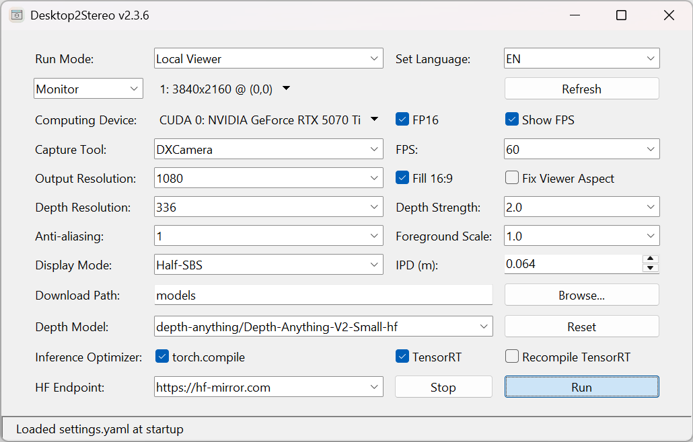  
### **Local Viewer** Mode
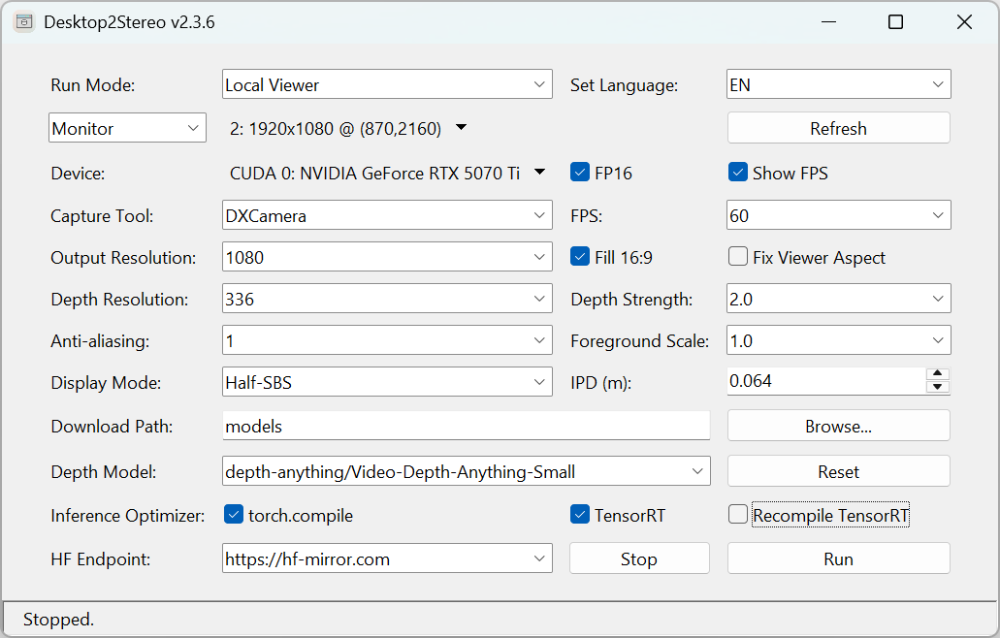 
> [!Tip]  
> **Local Viewer** mode is best for low-latency usage with SteamVR/Virtual Desktop/AR Glasses as wired display.   
1. Choose Run Mode as **Local Viewer**.  
2. Choose capture target by **Monitor** or **Window** mode, you can use `Refresh` button to update to the latest list of **Monitor** or **Window**. 
3. Click the **Stereo Viewer** window, Use `← Left ` or `→ Right` arrow keys to switch the **Stereo Viewer** window to second (virtual) monitor display. 
4. Press `Space` or `Enter` or XBOX game controller button `A` to toggle fullscreen mode (On MacOS you may have to quickly press twice).   
5. Now you can use AR/VR to view the SBS or TAB output.   
   - **AR** need to switch to 3D mode to connect as a 3840*1080 (Full Side-by-Side, `FUll-SBS`) display.  
    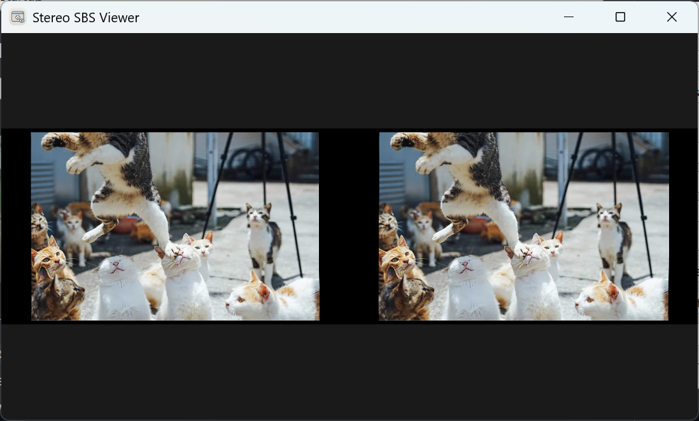
   - **VR** need to use 2nd Display/Virtual Display (VDD) with Desktop+[Steam VR] or Virtual Desktop[PC/Standalone VR] or OBS + Wolvic Browser [Standalone VR] to comopose the `Half-SBS` (Half Side-by-Side) / `Full-SBS` (Full Side-by-Side) / `TAB` (Top-and-Bottom) display to 3D.   
   - You can use `Tab` key to toggle `Half-SBS`/`Full-SBS`/`TAB`  mode.   
   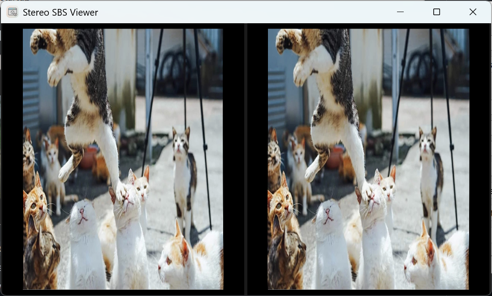    
   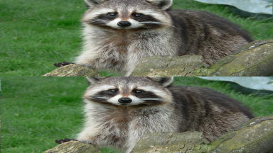
6. Real-time modification of **depth strength**.  
    Use `↑ Up` or `↓ Down` arrow keys to increase/decrease the depth strength by a step of `0.5`. To reset press `0` key. 
    The defination of **depth strength** is in the [detailed settings](###detailed-settings) session.      
7. Press `Esc` to exit the **Stereo Viewer**. 
> [!TIP]  
> The Depth value will show below the FPS indicator if `Show FPS` is **ON**.  
### **RTMP Streamer** mode
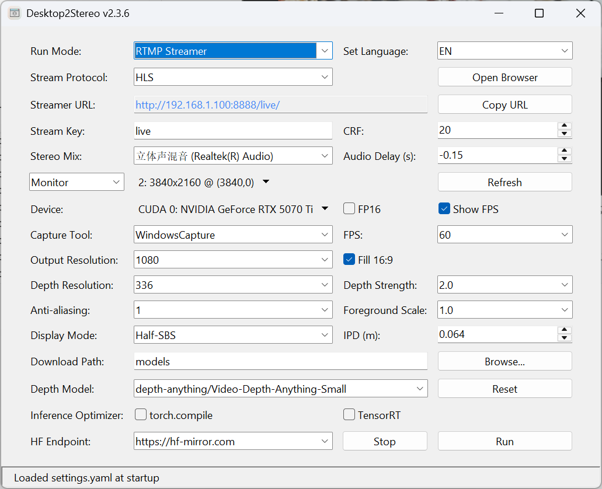  
> [!Tip]  
> **RTMP Streamer** mode is best for wireless streaming with video and audio together to client devices/apps by capturing the local **Stereo Viewer** window, like **VLC Player**, **Wolvic Browser**, etc., but it may have a latency of `1~3` seconds.   

1. Choose run mode as **RTMP Streamer**.  
2. Choose a **Stream Protocol**:  recommanded to use `HLS`.    
3. Select a audio device
    - **Windows**
    Select the **Stereo Mix** as `Stereo Mix (Realtek(R))`, and select `Realtek(R) HD Audio` as the system Sound Output device.  
    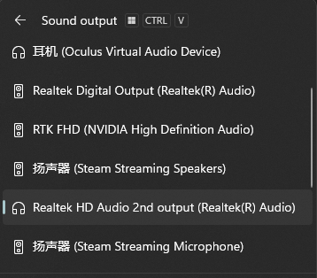
    If your Windows device does not have the `Stereo Mix (Realtek(R))`, please install the [Screen Capture Recorder](https://github.com/rdp/screen-capture-recorder-to-video-windows-free/releases/latest) and select the **Stereo Mix** as `virtual-audio-capturer`.  
                        
    - **MacOS**
    Install one of the following software containing the audio capture driver:   
    a. **BlackHole**: https://existential.audio/blackhole/  
    b. **Virtual Desktop Streamer**: https://www.vrdesktop.net/  
    c. **Loopback**: https://rogueamoeba.com/loopback/ (Commercial)  
    d. Or other virual audio devices  
    Select the **Stereo Mix** as `BlackHole 2ch` or `Virtual Desktop Speakers` or `Loopback Audio` or other virtual audio devices accordingly, and select the system **Output** device with same name.  
    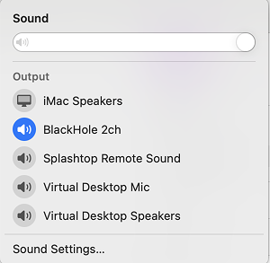  
    - **Ubuntu**
    Select the **Stereo Mix** device name ended with `stereo.monitor` i.e. `alsa_output.pci-xxxx_xx_1x.x.analog-stereo.monitor`, and select **Output Device** as `Digtial Output(S/PDIF)-xxxx` in system sound settings.  
    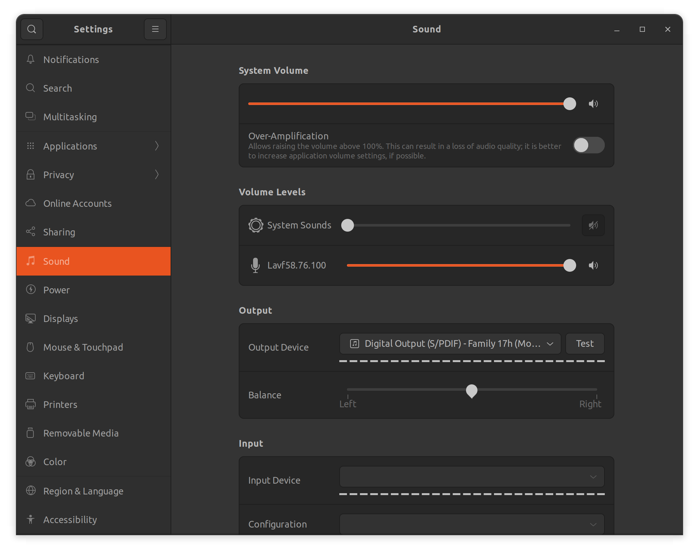  
4. Set a **Stream Key**, default is `live`.  
5. (Optional) Adjust the **Audio Delay**, `negative` value means play the audio in advance before the video, `positive` value means delay the audio play after the video.  
6. (Optional) It is recommended to use a second (virtual) screen with a resolution equal to or larger than the main screen to place the Stereo Viewer window.
7. The other settings are the same as the **Local Viewer**, click `Run` button to run.  
8. On client device, key in the streaming URL according to the **Stream Protocal**.  
> [!Tip]
> **AR**: Use **VLC Player** to open the `HLS M3U8` URL directly with `Full-SBS` mode.  
> **VR** / **Huawer AR**: Use **Wolvic Browser** to open the `HLS` URL directly with `Half_SBS` / `TAB` mode.  
> For **MacOS**, you can also use `WebRTC` URL.  
> Other `RTSP`, `RTMP`, `HLS M3U8` protocal may be chosen for **VLC Player** [i.e. extend screen mode for AR glasses] / VR Video Apps (**DeoVR**) on client devices.  
> If using `Full-SBS` output at the same resolution as the main screen, you will need a screen with twice the width of the original screen. For example, if the main screen is `4K (3840x2160)`, the second (virtual) screen needs to be `8K (7680x2160)`.
### **MJPEG Streamer** mode
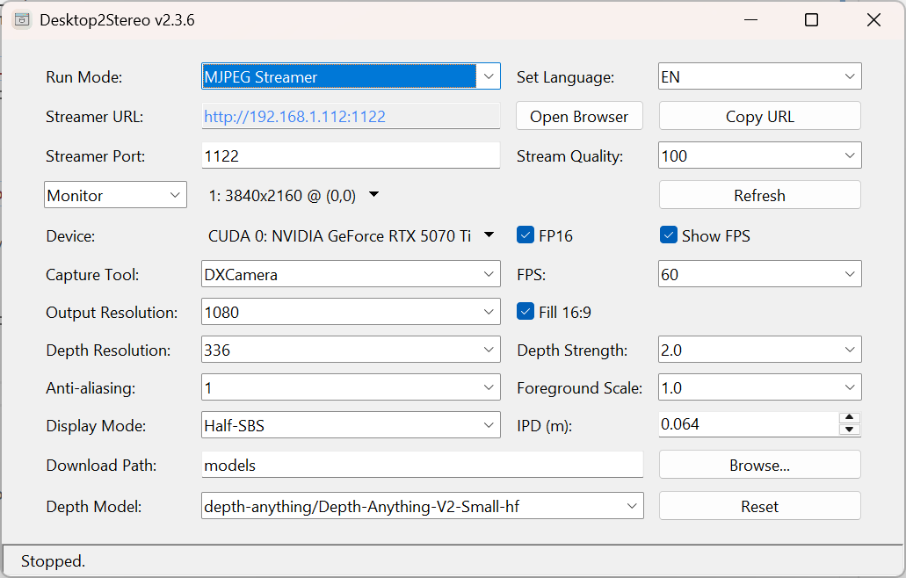  
> [!Tip]  
> **MJPEG Streamer** mode is wireless streaming with video only to client devices/apps with lower latency, like **Wolvic Browser**, etc.    
> For VR or Huawei AR: [Wolvic Browser (Chromium Based)](https://wolvic.com/dl/) is recommanded to open the HTTP MJPEG link.  

1. Choose run mode as **MJPEG Streamer**   
2. Assign **Streaming Port**, default is `1122`.   
3. The other settings are the same as the **Local Viewer**, click `Run` button.  
4. On client device, key in the **Streamer URL** to access the video.  
5. For audio, please use **Bluetooth** or **Headphones** connected to your PC or Mac.  

### **Legacy Streamer** mode
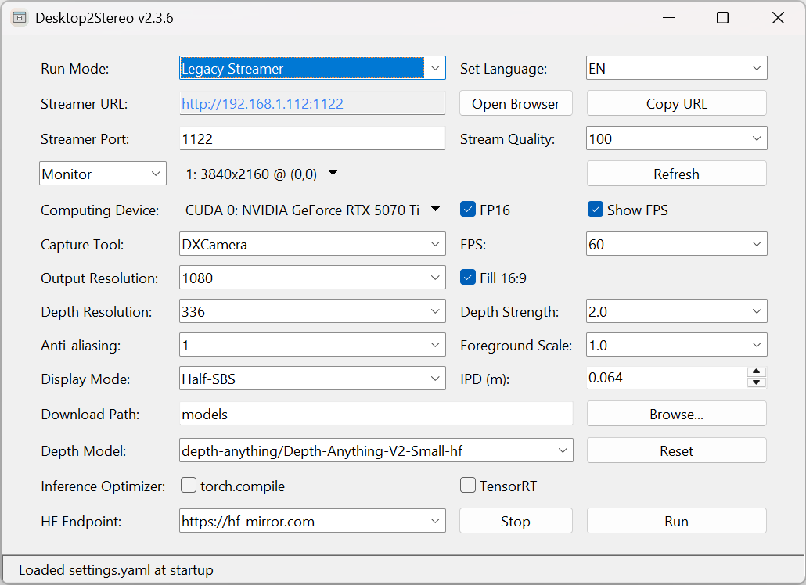  
> [!Tip]  
> **Legacy Streamer** mode a legacy MJPEG streaming mode, which uses PyTorch method to generate left and right eye scenes.   
The main usage is the same as the **MJPEG Streamer** mode.  

### **3D Monitor** mode (Windows Only)
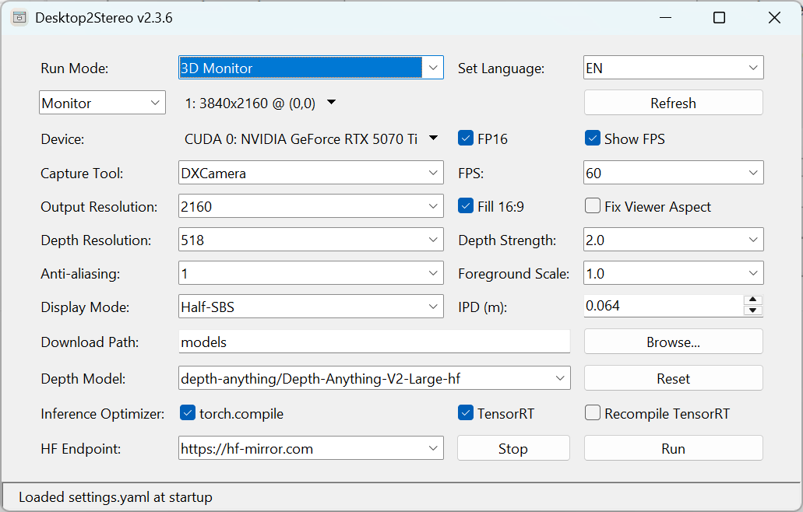  
> [!Tip]  
> **3D Monitor** mode a special **Local Viewer** mode dedicated for a 3D Monitor, no virtual display driver needed for this mode. It can only run as **fullscreen** and be used **locally** as the screen capture attribute for the **Stereo Viewer** window is `disabled` globally.  
> In 3D Monitor mode, please use the passthrough cursor on either left or right scene to control your PC. 

## Full Keyboard Shortcuts
> [!Tip]
> Need to click the **Stereo Viewer** window/tab first to use.  

| Key        | Action Description                                   | Supported Run Mode(s)                                     |
|-------------|------------------------------------------------------|------------------------------------------------------------|
| `Enter` / `Space`   | Toggle fullscreen          | Local Viewer                  |
| `← Left`    | Move window to adjacent monitor (previous)           | Local Viewer / RTMP Streamer / 3D Monitor                  |
| `→ Right`   | Move window to adjacent monitor (next)               | Local Viewer / RTMP Streamer / 3D Monitor                  |
| `Esc`       | Close the application window                         | Local Viewer / RTMP Streamer / MJPEG Streamer / 3D Monitor |
| `↑ Up`      | Increase depth strength by 0.5 (max 10)              | Local Viewer / RTMP Streamer / MJPEG Streamer / 3D Monitor |
| `↓ Down`    | Decrease depth strength by 0.5 (min 0)               | Local Viewer / RTMP Streamer / MJPEG Streamer / 3D Monitor |
| `0`         | Reset depth strength to original value               | Local Viewer / RTMP Streamer / MJPEG Streamer / 3D Monitor |
| `Tab`       | Cycle to the next display mode                       | Local Viewer / RTMP Streamer / MJPEG Streamer / 3D Monitor |
| `F`         | Toggle FPS display                                   | Local Viewer / RTMP Streamer / MJPEG Streamer / 3D Monitor |
| `A`         | Toggle “fill 16:9” mode                              | Local Viewer / RTMP Streamer / MJPEG Streamer / 3D Monitor |
| `L`         | Toggle lock Stereo Viewer window aspect ratio lock   | Local Viewer                                               |

## Detailed Settings Guide
All optional settings can be modified on the GUI window and saved to the `settings.yaml`. Each time you click `Run`, the settings will be saved automatically, and clicking `Reset` will restore the default settings.  

1. **Run Mode**  
    `5` **Run Mode**s are available: `Local Viewer`, `MJPEG Streamer`, `RTMP Streamer`, `Legacy Streamer`, `3D Monitor` (Windows Only).  
2. **Set Language**  
    English (`EN`) and Simplified Chinese (`CN`) are supported. 
3. **Monitor**  or **Window** mode
   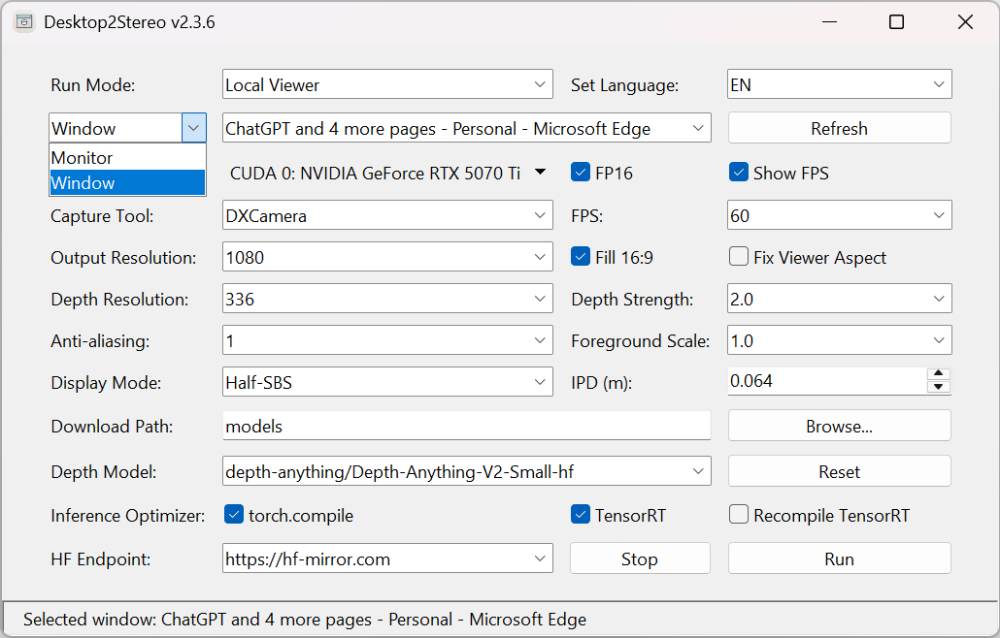
    Default is your Primary Monitor (mostly shall follow the monitor numbers in your system settings).
    You can toggle to Window capture mode as well, the optional menus will include all the active window names. 
4. **Computing Device**  
    Default shall be your GPU (`CUDA`/`DirectML`/`MPS`), or `CPU` if you don't have a compatible computing device.    
5. **FP16**
    Recommanded for most computing devices for better performance. If your device does not support `FP16` DataType, disable it. 
6. **Show FPS** 
    Show FPS on the titlebar of the **Stereo Viewer** and as an on-screen indicator on the output left and right eye scenes.     
7. **Capture Tool** (Windows Only)
   - **DXCamera**: Based on [wincam](https://github.com/lovettchris/wincam) using `DXGI Desktop Duplication API`, it has the highest FPS but higher CPU temperature. 
   - **WindowsCapture**: Based on [Windows-Capture Python](https://github.com/NiiightmareXD/windows-capture/tree/main/windows-capture-python)  using `Graphics Capture API`, it has slightly lower FPS but lower CPU usage and temperature. It needs to 
8. **FPS** (frames per second)
    FPS can set as your monitor refresh rate, default input FPS is `60`.   
    It determins the freqency of the screen caputre process and streaming fps for streamer modes (higher FPS does not ensure smoother output, depending on your devices).
9. **Output Resolution**
    Default is `1080` (i.e. **1080p**, `1920x1080`) for a smoother experience. `2160` (**4K**, i.e. `3840x2160`) and `1440` (**2K**, i.e. `2560x1440`) resolutions are also available if you have powerful devices. 
    If the input source has smaller resolution than the output, the **Output Resolution** will be applied same as the smaller one. 
    The **Output Resolution** by default keeps the aspect ratio of the input source. 
10. **Fill 16:9**  
    Enabled by default. If the aspect of input source is not `16:9`, the black background will be applied to fill it to `16:9`. 
11. **Fix Viewer Aspect** (**Local Viewer** mode Only)  
    Diabled by default. This option is to lock the window of **Stereo Viewer**, which may be useful for the upscaling and frame generation apps like [Lossless Scaling](https://store.steampowered.com/app/993090/Lossless_Scaling/).   
12. **Depth Resolution**  
    Higher **Depth Resolution** can give better depth details but cause higher GPU usage, which is also related to the model training settings.  
    Default **Depth Resolution** is set to `336` for balanced performance on `Depth-Anything-V2` models. The **Depth Resolution** options varies among different depth models. 
13. **Depth Strength**  
    With higher **Depth Strength**, 3D depth effect of the object would be stronger. However, higher value can induce visible artifacts and distortion.
    Default is set to `2.0`. The recomanded depth strength range is `(1, 5)`.  
14. **Anti-Aliasing**
    This can be effective to reduce jagged edges and artifacts under high **Depth Strength**, default value is set as `1` for most cases. Higher value may reduce the depth details. 
15. **Foreground Scale**  
    Default value is `1.0`. `Positive` value means foreground closer, background further. `Negative` value means foreground flatter, background closer. `0` is no change of foreground and background strength.  
16. **Display Mode**  
    It determins how the left and right eye scences are arranged in the output. Default is `Half-SBS` for most VR devices, `TAB` is also an alternative; `Full-SBS` is mainly for AR glasses.
    - **Full-SBS** (Full Side-by-Side, `32:9`)  
    Two full-resolution images are placed side by side: one for the left eye, one for the right.  
    Requires a display capable of handling double-width input.  
    Offers higher image quality but demands more bandwidth and processing.  
    - **Half-SBS** (Side-by-Side Half, `16:9`)  
    Two images are placed side by side, but each is compressed horizontally to fit into a single frame.  
    More compatible with standard displays and media players.  
    Slightly lower image quality due to reduced resolution per eye.  
    - **TAB** (Top-and-Bottom, `16:9`)  
    Left and right eye images are stacked vertically: one on top, one on bottom.  
    Each image is compressed vertically to fit the frame.  
    Common in streaming and broadcast formats; quality similar to Half-SBS.  
17. **IPD** (Interpupillary Distance)  
    IPD is the distance between the centers of your pupils, it affects how your brain interprets stereoscopic 3D. 
    The default IPD is `0.064` in meter (m), which is the average human IPD value. 
18. **Stream Protocal**  (**RTMP Streamer** Only)
   Default is `HLS` for best compatibility, and `HLS M3U8` can be used in mobile **VLC Player**. `RTMP`, `RTSP`, `HLS`, `HLS M3U8`, `WebRTC` are provided. You can toggle the protocal to show the target URL, all URLs are ready to use when the **RTMP Streamer** is working. 
19. **Streamer URL** (**RTMP Streamer**, **MJPEG Streamer**, **Legacy Streamer** Only)  
   Read only, dynamically determined by the streaming protocal and your local ip.  
20. **Streamer Key** (**RTMP Streamer** Only)  
   The private key string set for **RTMP Streamer**, which will be applied in the **Streamer URL**.  
21. **CRF** (**RTMP Streamer** Only)  
   Deafalt is `20`, you can set it in the range of `18~23`. It refers to **Constant Rate Factor** that controls the video bitrate. A **lower value** is a **higher quality**.  
22. **Stereo Mix** (**RTMP Streamer** Only)  
   This is the **Strereo Mix** device to capture the system playback audio.   
   On Windows, **Strereo Mix** device is mostly `Stereo Mix (Realtek(R))` to be used with `Realtek(R) HD Audio` as the output device in Windows audio settings. Or use the virtual audio device from [Screen Capture Recorder](https://github.com/rdp/screen-capture-recorder-to-video-windows-free/releases/latest).   
   On MacOS, you can choose **Strereo Mix** device [BlackHole](https://existential.audio/blackhole/) or [Virtual Desktop SPeakers](https://www.vrdesktop.net/) or [Loopback] or other virual audio devices. Please use the same audio outpout device in MacOS auido settings.  
23. **Audio Delay** (**RTMP Streamer** Only)  
   Default is `-0.15` seconds, which is used for align the processed audio and video timestamp. A `negative value` will make the audio earlier than the video, whereas a `positive value` will make the audio later than the video.  
24. **Download Path**  
   Default download path is the `models` folder under the working directory.
25. **Depth Model**
    Modify the depth model id from [HuggingFace](https://huggingface.co/), the model id under `depth_model` mostly shall end with `-hf`.  
    Large model can cause higher GPU usage and latency.   
    Default depth model: `depth-anything/Depth-Anything-V2-Small-hf`. 
    You can also manually add the hugging face models in the `settings.yaml` which including `model.safetensors`, `config.json`, `preprocessor_config.json` files on [HuggingFace](https://huggingface.co/).     
    **Currently supported models**:  
      - depth-anything/Depth-Anything-V2-Small-hf
      - depth-anything/Depth-Anything-V2-Base-hf
      - depth-anything/Depth-Anything-V2-Large-hf
      - depth-anything/Video-Depth-Anything-Small
      - depth-anything/Video-Depth-Anything-Base
      - depth-anything/Video-Depth-Anything-Large
      - depth-anything/DA3-SMALL
      - depth-anything/DA3-BASE
      - depth-anything/DA3-LARGE
      - depth-anything/DA3-GIANT
      - depth-anything/DA3METRIC-LARGE
      - depth-anything/DA3NESTED-GIANT-LARGE
      - depth-anything/Depth-Anything-V2-Metric-Outdoor-Small-hf
      - depth-anything/Depth-Anything-V2-Metric-Outdoor-Base-hf
      - depth-anything/Depth-Anything-V2-Metric-Outdoor-Large-hf
      - depth-anything/Depth-Anything-V2-Metric-Indoor-Small-hf
      - depth-anything/Depth-Anything-V2-Metric-Indoor-Base-hf
      - depth-anything/Depth-Anything-V2-Metric-Indoor-Large-hf
      - depth-anything/Metric-Video-Depth-Anything-Small
      - depth-anything/Metric-Video-Depth-Anything-Base
      - depth-anything/Metric-Video-Depth-Anything-Large
      - depth-anything/prompt-depth-anything-vits-hf
      - depth-anything/prompt-depth-anything-vits-transparent-hf
      - depth-anything/prompt-depth-anything-vitl-hf
      - LiheYoung/depth-anything-small-hf
      - LiheYoung/depth-anything-base-hf
      - LiheYoung/depth-anything-large-hf
      - xingyang1/Distill-Any-Depth-Small-hf
      - lc700x/Distill-Any-Depth-Base-hf
      - xingyang1/Distill-Any-Depth-Large-hf
      - facebook/dpt-dinov2-small-kitti
      - lc700x/dpt-dinov2-base-kitti-hf
      - lc700x/dpt-dinov2-large-kitti-hf
      - lc700x/dpt-dinov2-giant-kitti-hf
      - lc700x/dpt-dinov2-small-nyu-hf
      - lc700x/dpt-dinov2-base-nyu-hf
      - lc700x/dpt-dinov2-large-nyu-hf
      - facebook/dpt-dinov2-giant-nyu
      - lc700x/depth-ai-hf
      - lc700x/dpt-hybrid-midas-hf
      - Intel/dpt-beit-base-384
      - Intel/dpt-beit-large-512
      - Intel/dpt-large
      - lc700x/dpt-large-redesign-hf
      - Intel/zoedepth-nyu-kitti
      - Intel/zoedepth-nyu
      - Intel/zoedepth-kitti
      - apple/DepthPro-hf # Slow, NOT recommand  
  
26. **HF Endpoint** (Hugging Face)  
   [HF-Mirror](https://hf-mirror.com) is a mirror site of the original [Hugging Face](https://huggingface.co/) site hosting AI models. The depth model will automatically be downloaded to **Download Path** from [Hugging Face](https://huggingface.co/) at the first run. 
27. **Inference Optimizer** (Windows/Ubuntu Only)
    These optimizers can typically increase the output FPS by `30%~50%`. However, not all models support **Inference Optimizer**, if the optimization fails, the inference process will fall back to PyTorch.  
    **NVIDIA GPUs**:
    - **torch.compile**: it leverages Triton under the hood to generate optimized kernels automatically, and provides slight to moderate speedups by fusing operations and reducing overhead. 
    - **TensorRT**: it is NVIDIA’s high-performance deep learning inference SDK. It optimizes trained models for deployment, especially on NVIDIA GPUs, and it provides significant speedups and high inference efficiency.  

    **DirectML** (**AMD GPUs**, etc.):  
    - **Unlock Threads (Legacy Streamer)**: unlock the multithreads for **Legacy Streamer** mode. 
> [!Warning]  
> **Unlock Threads (Legacy Streamer)** sometimes fails with `UTF-8 error` under Python3.11 due to the limitations of [torch-directml](https://github.com/microsoft/DirectML?tab=readme-ov-file#pytorch-with-DirectML) libraries. You may try stop and run multiple times for a successful streaming process.  
## References
```BIBTEX
@article{depthanything3,
  title={Depth Anything 3: Recovering the visual space from any views},
  author={Haotong Lin and Sili Chen and Jun Hao Liew and Donny Y. Chen and Zhenyu Li and Guang Shi and Jiashi Feng and Bingyi Kang},
  journal={arXiv preprint arXiv:2511.10647},
  year={2025}
}

@article{video_depth_anything,
  title={Video Depth Anything: Consistent Depth Estimation for Super-Long Videos},
  author={Chen, Sili and Guo, Hengkai and Zhu, Shengnan and Zhang, Feihu and Huang, Zilong and Feng, Jiashi and Kang, Bingyi},
  journal={arXiv:2501.12375},
  year={2025}
}

@article{depth_anything_v2,
  title={Depth Anything V2},
  author={Yang, Lihe and Kang, Bingyi and Huang, Zilong and Zhao, Zhen and Xu, Xiaogang and Feng, Jiashi and Zhao, Hengshuang},
  journal={arXiv:2406.09414},
  year={2024}
}

@inproceedings{lin2024promptda,
  title={Prompting Depth Anything for 4K Resolution Accurate Metric Depth Estimation},
  author={Lin, Haotong and Peng, Sida and Chen, Jingxiao and Peng, Songyou and Sun, Jiaming and Liu, Minghuan and Bao, Hujun and Feng, Jiashi and Zhou, Xiaowei and Kang, Bingyi},
  journal={arXiv},
  year={2024}
}

@inproceedings{depth_anything_v1,
  title={Depth Anything: Unleashing the Power of Large-Scale Unlabeled Data}, 
  author={Yang, Lihe and Kang, Bingyi and Huang, Zilong and Xu, Xiaogang and Feng, Jiashi and Zhao, Hengshuang},
  booktitle={CVPR},
  year={2024}
}

@article{li2024amodaldepthanything,
  title={Amodal Depth Anything: Amodal Depth Estimation in the Wild}, 
  author={Li, Zhenyu and Lavreniuk, Mykola and Shi, Jian and Bhat, Shariq Farooq and Wonka, Peter},
  year={2024},
  journal={arXiv preprint arXiv:x},
  primaryClass={cs.CV}}

@article{he2025distill,
  title   = {Distill Any Depth: Distillation Creates a Stronger Monocular Depth Estimator},
  author  = {Xiankang He and Dongyan Guo and Hongji Li and Ruibo Li and Ying Cui and Chi Zhang},
  year    = {2025},
  journal = {arXiv preprint arXiv: 2502.19204}
}

@article {Ranftl2022,
    author  = "Ren\'{e} Ranftl and Katrin Lasinger and David Hafner and Konrad Schindler and Vladlen Koltun",
    title   = "Towards Robust Monocular Depth Estimation: Mixing Datasets for Zero-Shot Cross-Dataset Transfer",
    journal = "IEEE Transactions on Pattern Analysis and Machine Intelligence",
    year    = "2022",
    volume  = "44",
    number  = "3"
}

@article{birkl2023midas,
      title={MiDaS v3.1 -- A Model Zoo for Robust Monocular Relative Depth Estimation},
      author={Reiner Birkl and Diana Wofk and Matthias M{\"u}ller},
      journal={arXiv preprint arXiv:2307.14460},
      year={2023}
}

@article{bhat2023zoedepth,
  title={Zoedepth: Zero-shot transfer by combining relative and metric depth},
  author={Bhat, Shariq Farooq and Birkl, Reiner and Wofk, Diana and Wonka, Peter and M{\"u}ller, Matthias},
  journal={arXiv preprint arXiv:2302.12288},
  year={2023}
}

@inproceedings{Bochkovskii2024:arxiv,
  author     = {Aleksei Bochkovskii and Ama\"{e}l Delaunoy and Hugo Germain and Marcel Santos and
               Yichao Zhou and Stephan R. Richter and Vladlen Koltun},
  title      = {Depth Pro: Sharp Monocular Metric Depth in Less Than a Second},
  booktitle  = {International Conference on Learning Representations},
  year       = {2025},
  url        = {https://arxiv.org/abs/2410.02073},
}

@article{DBLP:journals/corr/abs-2103-13413,
  author    = {Ren{\'{e}} Ranftl and
               Alexey Bochkovskiy and
               Vladlen Koltun},
  title     = {Vision Transformers for Dense Prediction},
  journal   = {CoRR},
  volume    = {abs/2103.13413},
  year      = {2021},
  url       = {https://arxiv.org/abs/2103.13413},
  eprinttype = {arXiv},
  eprint    = {2103.13413},
  timestamp = {Wed, 07 Apr 2021 15:31:46 +0200},
  biburl    = {https://dblp.org/rec/journals/corr/abs-2103-13413.bib},
  bibsource = {dblp computer science bibliography, https://dblp.org}
}

@misc{oquab2023dinov2,
      title={DINOv2: Learning Robust Visual Features without Supervision}, 
      author={Maxime Oquab and Timothée Darcet and Théo Moutakanni and Huy Vo and Marc Szafraniec and Vasil Khalidov and Pierre Fernandez and Daniel Haziza and Francisco Massa and Alaaeldin El-Nouby and Mahmoud Assran and Nicolas Ballas and Wojciech Galuba and Russell Howes and Po-Yao Huang and Shang-Wen Li and Ishan Misra and Michael Rabbat and Vasu Sharma and Gabriel Synnaeve and Hu Xu and Hervé Jegou and Julien Mairal and Patrick Labatut and Armand Joulin and Piotr Bojanowski},
      year={2023},
      eprint={2304.07193},
      archivePrefix={arXiv},
      primaryClass={cs.CV}
}

```

## Credits
- [lovettchris/wincam](https://github.com/lovettchris/wincam/)  
- [NiiightmareXD/windows-capture](https://github.com/NiiightmareXD/windows-capture)  
- [BoboTiG/python-mss](https://github.com/BoboTiG/python-mss)  
- [nagadomi/nunif](https://github.com/nagadomi/nunif)  
- [VirtualDrivers/Virtual-Display-Driver](https://github.com/VirtualDrivers/Virtual-Display-Driver)
- [waydabber/BetterDisplay](https://github.com/waydabber/BetterDisplay)  
- Other related tools and libraries  
- All feedback from the users  
