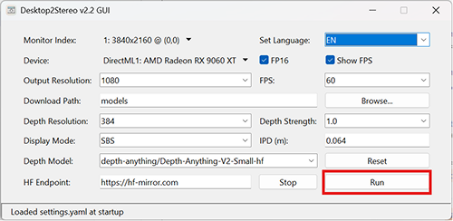

# Desktop2Stereo: a 2D Desktop to 3D Stereo App
[中文版本](./readmeCN.md)   
  
   
A universal real-time 2D to 3D App that supports AMD/NVIDIA/Intel/Qualcomm GPU/Apple Silicon devices on Windows/Mac/Linux OS, powered by Depth Estimation AI Models
## Alternative Download Link
[Quark NetDrive](https://pan.quark.cn/s/9d2bcf039b96)  
Access code: `1vcn`  
## Supported Hardware  
1. AMD GPU  
2. NVIDIA GPU  
3. Apple Silicon Chip (M1, M2, M3, M4, ...)  
4. DirectML compatible devices (Intel Arc/Iris GPU, Qualcomm® Adreno GPU, etc. **Windows** only)
## Supported OS  
1. Windows 10/11 (x64/Arm64)
2. MacOS 10.16 or later  
3. Linux OS (beta)  
## Install and Run  
### Windows  
1. Install latest GPU driver  
    **AMD GPU**: Download latest GPU driver from [AMD Drivers and Support for Processors and Graphics](https://www.amd.com/en/support/download/drivers.html). 
    **NVIDIA GPU**: Download latest GPU driver from [NVIDA Official GeForce Drivers](https://www.nvidia.com/en-us/geforce/drivers/).  
    **Intel GPU**: Download latest GPU driver from [Download Intel Drivers and Software](https://www.intel.com/content/www/us/en/download-center/home.html/).  
    **Qualcomm GPU**: Download latest GPU driver from [Qualcomm® Adreno™ Windows Graphics Drivers for Snapdragon® X Platform](https://softwarecenter.qualcomm.com/catalog/item/Windows_Graphics_Driver).  
    **Other DirectML devices**: Please install the latest hardware driver accordingly.  
2. Install **Python 3.10**  
    Download from [Python.org](https://www.python.org/ftp/python/3.10.11/python-3.10.11-amd64.exe) and install.  
3. Download Desktop2Stereo app  
    Download the [Desktop2Stereo.zip](https://github.com/lc700x/desktop2stereo/releases/latest) and unzip it to local disk.  
4. Install python environment  
    **AMD/Intel/Qualcomm GPU and other DirectML compatible devies**: Doulbe click `install-dml.bat`.  
    **NVIDIA GPU**: Doulbe click `install-cuda.bat`.  
5. Run **Stereo2Desktop GUI** application  
    Doulbe click `run.bat`.  
### MacOS 
1. Install **Python 3.10**  
    Download from [Python.org](https://www.python.org/ftp/python/3.10.11/python-3.10.11-macos11.pkg) and install.  
2. Download Desktop2Stereo app  
    Download the [Desktop2Stereo.zip](https://github.com/lc700x/desktop2stereo/releases/latest) and unzip it to local disk.  
3. Install Python environment  
    Doulbe click `install-mps` executable. (Please allow open in **Privacy and Security Settings**)
4. Run **Stereo2Desktop GUI** application  
    Doulbe click `run_mac` executable.  (Please allow open in **Privacy and Security Settings**, **"Screen Recording"** permission is required)
### Linux (Beta)
1. Install latest GPU driver  
**AMD GPU**: Download latest GPU driver and ROCm from [AMD Drivers and Support for Processors and Graphics](https://www.amd.com/en/support/download/drivers.html). 
**NVIDIA GPU**: Download latest GPU driver from [AMD Drivers and Support for Processors and Graphics](https://www.nvidia.com/en-us/geforce/drivers/).
1. Install **Python 3.10**  
    ```bash
    # Example: Ubuntu
    sudo add-apt-repository ppa:savoury1/python
    sudo apt update
    sudo apt-get install python3.10
    ```
2. Download Desktop2Stereo app  
   Download the [Desktop2Stereo.zip](https://github.com/lc700x/desktop2stereo/releases/latest) and unzip it to local disk.
3. Install Python environment  
    **AMD GPU**: Run `install-rocm.bash`: 
    ```bash
    bash install-rocm.bash
    ```
    **NVIDIA GPU**: Run `install-cuda.bash`:  
    ```bash
    bash install-cuda.bash
    ```
4. Run **Stereo2Desktop GUI** application  
    Run `run_linux.bash`:  
    ```bash
    bash run_linux.bash
    ```
## Desktop2Stereo GUI App
### Quick Run Desktop2Stereo
Just use the default settnigs and click `Run`, and then click `OK` to run the Stereo Viewer window. 

### Stereo Viewer Window

1. Use `← Left ` or `→ Right` arrow keys to switch the **Stereo Viewer** window to second (virtual) monitor display. 
2. Set your video/game on the main screen (full screen mode if you needed).  
3. Click the **Stereo Viewer** on second (virtual) monitor display to make sure the **Stereo Viewer** is the 1st active application. Press `space` to toggle full screen mode.   
4. Now you can use AR/VR to view the SBS or TAB output.   
- **AR** need to switch to 3D mode to connect as a 3840*1080 (Full Side-by-Side, `FUll-SBS`) display.  
 
- **VR** need to use 2nd Display/Virtual Display (VDD) with Desktop+[PC VR] or Virtual Desktop[PC/Standalone VR] or OBS + Wolvic Browser [Standalone VR] to comopose the `SBS` (Side-by-Side) / `TAB` (Top-and-Bottom) display to 3D.   
- You can use `Tab` key to toggle `SBS`/`TAB`  mode.   
    

5. Real-time modification of **depth strength**.  
   Use `↑ Up ` or `↓ Right` arrow keys to increase/decrease the depth strength by a step of 0.1. To reset press `0` key. 
   The defination of **depth strength** is in the [detailed settings](###detailed-settings) session.    
6. Press `Esc` to exit the **Stereo Viewer**. 
### Detailed Settings
All optional settings can be modified on the GUI window and saved to the `settings.yaml`. Each time you click `Run`, the settings will be saved automatically, and clicking `Reset` will restore the default settings.  


1. **Set Language**  
    English (`EN`) and Simplified Chinese (`CN`) are supported. 
2. **Monitor index**  
    Default is your Primary Monitor (mostly shall follow the monitor numbers in your system settings).  
3. **Device**  
    Default shall be your GPU (`CUDA`/`DirectML`/`MPS`), or `CPU` if you don't have a compatible GPU device.  
4. **FP16**
    Recommanded for most computing devices for better performance. If your device does not support `FP16` DataType, disable it. 
5. **Show FPS** 
    Show FPS on the topbar of the **Stereo Viewer**.     
6. **Output Resolution**
    Default output resolution is `1080` (**1080p**, `1920x1080`) for a smoother experience. `2160` (**4K**, `3840x2160`) and `1440` (**2K**, `2560x1440`) resolutions are also available if you have powerful devices. 
7. **FPS** (frames per second)
    FPS can set as your monitor refresh rate, default input FPS is `60`. It determins the freqency of the screen caputre process (higher FPS does not ensure smoother output, depending on your devices).
8. **Depth Resolution**  
    Higher depth resolution can give better depth details but cause higher GPU usage, which is also related to the model training settings.  
    Default depth resolution is set to `384` for balanced performance.  
9. **Depth Strength**  
    With higher depth strength, 3D depth effect of the object would be stronger. However, higher value can induce visible artifacts.
    Default is set to `1.0`. The recomanded depth strength range is `(1, 5)`.  
10. **IPD** (Interpupillary Distance)  
    IPD is the distance between the centers of your pupils, it affects how your brain interprets stereoscopic 3D. 
    The default IPD is `0.064` in meter (m), which is the average human IPD value. 
11. **Download Path**  
   Default download path is the `models` folder under the working directory.
12. **Depth Model**
    Modify the depth model id from [HuggingFace](https://huggingface.co/), the model id under `depth_model` **mostly shall ends** with `-hf`.  
    Large model can cause higher GPU usage and latency.   
    Default depth model: `depth-anything/Depth-Anything-V2-Small-hf`  
    *Currently supported models*:  
    ```yaml
    Model List:
    - depth-anything/Depth-Anything-V2-Large-hf
    - depth-anything/Depth-Anything-V2-Base-hf
    - depth-anything/Depth-Anything-V2-Small-hf
    - depth-anything/Depth-Anything-V2-Metric-Outdoor-Large-hf
    - depth-anything/Depth-Anything-V2-Metric-Outdoor-Base-hf
    - depth-anything/Depth-Anything-V2-Metric-Outdoor-Small-hf
    - depth-anything/Depth-Anything-V2-Metric-Indoor-Large-hf
    - depth-anything/Depth-Anything-V2-Metric-Indoor-Base-hf
    - depth-anything/Depth-Anything-V2-Metric-Indoor-Small-hf
    - LiheYoung/depth-anything-large-hf
    - LiheYoung/depth-anything-base-hf
    - LiheYoung/depth-anything-small-hf
    - xingyang1/Distill-Any-Depth-Large-hf
    - xingyang1/Distill-Any-Depth-Small-hf
    - apple/DepthPro-hf # Depth: 1536
    - Intel/dpt-large # Slow, NOT recommand
    ```
   You can also manually add the hugging face models in the `settings.yaml` which including the following:  
   `model.safetensors`  
   `config.json`  
   `preprocessor_config.json`    
13. **HF Endpoint** (Hugging Face)  
   [HF-Mirror](https://hf-mirror.com) is a mirror site of the original [Hugging Face](https://huggingface.co/) site hosting AI models. The depth model will automatically be downloaded to **Download Path** from [Hugging Face](https://huggingface.co/) at the first run.  
## References
```BIBTEX
@article{depth_anything_v2,
  title={Depth Anything V2},
  author={Yang, Lihe and Kang, Bingyi and Huang, Zilong and Zhao, Zhen and Xu, Xiaogang and Feng, Jiashi and Zhao, Hengshuang},
  journal={arXiv:2406.09414},
  year={2024}
}

@inproceedings{depth_anything_v1,
  title={Depth Anything: Unleashing the Power of Large-Scale Unlabeled Data}, 
  author={Yang, Lihe and Kang, Bingyi and Huang, Zilong and Xu, Xiaogang and Feng, Jiashi and Zhao, Hengshuang},
  booktitle={CVPR},
  year={2024}
}

@article{he2025distill,
  title   = {Distill Any Depth: Distillation Creates a Stronger Monocular Depth Estimator},
  author  = {Xiankang He and Dongyan Guo and Hongji Li and Ruibo Li and Ying Cui and Chi Zhang},
  year    = {2025},
  journal = {arXiv preprint arXiv: 2502.19204}
}

@inproceedings{Bochkovskii2024:arxiv,
  author     = {Aleksei Bochkovskii and Ama\"{e}l Delaunoy and Hugo Germain and Marcel Santos and
               Yichao Zhou and Stephan R. Richter and Vladlen Koltun},
  title      = {Depth Pro: Sharp Monocular Metric Depth in Less Than a Second},
  booktitle  = {International Conference on Learning Representations},
  year       = {2025},
  url        = {https://arxiv.org/abs/2410.02073},
}

@article{DBLP:journals/corr/abs-2103-13413,
  author    = {Ren{\'{e}} Ranftl and
               Alexey Bochkovskiy and
               Vladlen Koltun},
  title     = {Vision Transformers for Dense Prediction},
  journal   = {CoRR},
  volume    = {abs/2103.13413},
  year      = {2021},
  url       = {https://arxiv.org/abs/2103.13413},
  eprinttype = {arXiv},
  eprint    = {2103.13413},
  timestamp = {Wed, 07 Apr 2021 15:31:46 +0200},
  biburl    = {https://dblp.org/rec/journals/corr/abs-2103-13413.bib},
  bibsource = {dblp computer science bibliography, https://dblp.org}
}
```
