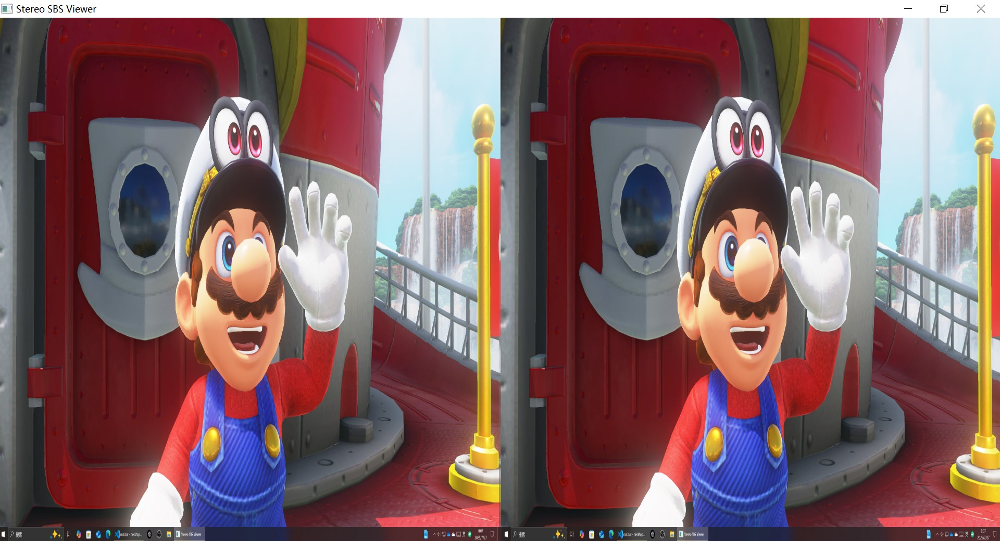

# 2D desktop to 3D stereo SBS with Depth Anything models (Support AMD/NVIDIA GPUs with DirectML)
## Hardware
AMD/NVIDIA GPUs and other DirectML compatible devices
## OS
Windows 10/11 64-bit OS
# Software
1. AMD GPU driver from [AMD Drivers and Support for Processors and Graphics](https://www.amd.com/en/support/download/drivers.html). For Other Compatible DirectML devices: (i.e. Nvidia GPU, .etc) please install latest hardware driver. 
2. Install **Python 3.10** from [Python.org](https://www.python.org/ftp/python/3.10.0/python-3.10.0-amd64.exe)
## Install and Run
1. Download repository to local disk
```powershell
git clone https://github.com/lc700x/desktop2stereo
```
2. Install python environment  
Doulbe click `install.bat`
3. Run Stereo Desktop application  
Doulbe click `run.bat`
4. Move the **Stereo SBS Viewer** window to the second monitor press `Space` to toggle fullscreen. Recommand to set automatically hide the taskbar on the captured screen. 

5. Click the **Stereo SBS Viewer** tab or use `ALT + TAB` to make sure the **Stereo SBS Viewer** is the 1st active application. 
6. Now you can use AR/VR to view the Full/Half SBS output. 
- AR need to switch to 3D mode to connect as a 3840*1080 display

- VR need to use 2nd Display/Virtual Display (VDD) with Desktop+[PC VR] or Virtual Desktop[PC/Standalone VR] or OBS+Wolvic [Standalone VR] to comopose the SBS display to 3D.

## Optional
1. Change Model
Modify the depth model id in the `depth.py` from [HuggingFace](https://huggingface.co/)], the model id **must ends with** `hf`. 
```python
from transformers import AutoImageProcessor, AutoModelForDepthEstimation
import torch
import torch_directml
import numpy as np
from threading import Lock

DML = torch_directml.device()
# change depth model ID if needed
MODEL_ID = "depth-anything/Depth-Anything-V2-Small-hf"
```
- Default model id: `depth-anything/Depth-Anything-V2-Small-hf`
- All supported models:  
`LiheYoung/depth-anything-large-hf`  
`LiheYoung/depth-anything-base-hf`  
`LiheYoung/depth-anything-small-hf`  
`depth-anything/Depth-Anything-V2-Large-hf`  
`depth-anything/Depth-Anything-V2-Base-hf`  
`depth-anything/Depth-Anything-V2-Small-hf`  

2. Change Captured Monitor
Modify the monitor index in the `main.py` (same as the monitor number in **Windows Settings - Display**).
```python
def capture_loop():
    cap = DesktopGrabber(monitor_index=1, downscale=0.5)
```
## References
```BIBTEX
@article{depth_anything_v2,
  title={Depth Anything V2},
  author={Yang, Lihe and Kang, Bingyi and Huang, Zilong and Zhao, Zhen and Xu, Xiaogang and Feng, Jiashi and Zhao, Hengshuang},
  journal={arXiv:2406.09414},
  year={2024}
}

@inproceedings{depth_anything_v1,
  title={Depth Anything: Unleashing the Power of Large-Scale Unlabeled Data}, 
  author={Yang, Lihe and Kang, Bingyi and Huang, Zilong and Xu, Xiaogang and Feng, Jiashi and Zhao, Hengshuang},
  booktitle={CVPR},
  year={2024}
}
```
## TO DO
To opitmize the inference performance and video generation, currently the output may not be very smooth. 
