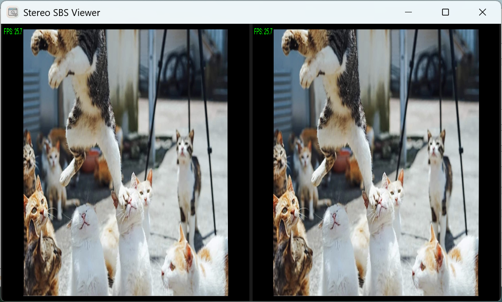

# Desktop2Stereo: 一个2D桌面转换3D立体画面的应用
[English Version](./readme.md)  
  
一个通用的实时2D转3D应用，支持AMD/NVIDIA/Intel/Qualcomm GPU/Apple Silicon设备，运行于Windows/Mac/Linux操作系统，由深度估计算法模型驱动
## 支持的硬件  
1. AMD GPU  
2. NVIDIA GPU  
3. Apple Silicon芯片(M1, M2, M3, M4, ...)  
4. 兼容DirectML的设备(如Intel Arc/Iris GPU，Qualcomm® Adreno GPU等，仅支持**Windows**)
## 支持的操作系统  
1. Windows 10/11 (x64/Arm64)  
2. MacOS 10.16或更高版本  
3. Linux操作系统(测试版)  
## 安装与运行  
### Windows  
1. 安装最新GPU驱动  
    **AMD GPU**: 从[AMD Drivers and Support for Processors and Graphics](https://www.amd.com/en/support/download/drivers.html)下载最新GPU驱动。  
    **NVIDIA GPU**: 从[NVIDA Official GeForce Drivers](https://www.nvidia.com/en-us/geforce/drivers/)下载最新GPU驱动。  
    **Intel GPU**: 从[Download Intel Drivers and Software](https://www.intel.com/content/www/us/en/download-center/home.html/)下载最新GPU驱动。  
    **Qualcomm GPU**: 从[Qualcomm® Adreno™ Windows Graphics Drivers for Snapdragon® X Platform](https://softwarecenter.qualcomm.com/catalog/item/Windows_Graphics_Driver)下载最新GPU驱动。  
    **其他DirectML设备**: 请根据硬件型号安装最新驱动。  
2. 安装**Python 3.10**  
    从[Python.org](https://www.python.org/ftp/python/3.10.11/python-3.10.11-amd64.exe)下载并安装。  
3. 下载Desktop2Stereo应用  
    从[Desktop2Stereo.zip](https://github.com/lc700x/desktop2stereo/releases/latest)下载并解压到本地磁盘。  
4. 安装Python运行环境  
    **AMD/Intel/Qualcomm GPU及其他DirectML兼容设备**: 双击`install-dml.bat`。  
    **NVIDIA GPU**: 双击`install-cuda.bat`。  
5. 运行**Stereo2Desktop GUI**应用程序  
    双击`run.bat`。  
### MacOS  
1. 安装**Python 3.10**  
    从[Python.org](https://www.python.org/ftp/python/3.10.11/python-3.10.11-macos11.pkg)下载并安装。  
2. 下载Desktop2Stereo应用  
    从[Desktop2Stereo.zip](https://github.com/lc700x/desktop2stereo/releases/latest)下载并解压到本地磁盘。  
3. 安装Python运行环境  
    双击`install-mps`可执行文件。(请在**隐私与安全设置**中允许运行)  
4. 运行**Stereo2Desktop GUI**应用程序  
    双击`run_mac`可执行文件。(请在**隐私与安全设置**中允许运行，需要授予**屏幕录制**权限)  
### Linux(测试版)  
1. 安装最新GPU驱动  
    **AMD GPU**: 从[AMD Drivers and Support for Processors and Graphics](https://www.amd.com/en/support/download/drivers.html)下载最新GPU驱动和ROCm。  
    **NVIDIA GPU**: 从[NVIDIA GeForce Drivers](https://www.nvidia.com/en-us/geforce/drivers/)下载最新GPU驱动。  
2. 安装**Python 3.10**  
    ```bash
    # 以Ubuntu为例
    sudo add-apt-repository ppa:savoury1/python
    sudo apt update
    sudo apt-get install python3.10
    ```  
3. 下载Desktop2Stereo应用  
    从[Desktop2Stereo.zip](https://github.com/lc700x/desktop2stereo/releases/latest)下载并解压到本地磁盘。  
4. 安装Python运行环境  
    **AMD GPU**: 运行`install-rocm.bash`：  
    ```bash
    bash install-rocm.bash
    ```  
    **NVIDIA GPU**: 运行`install-cuda.bash`：  
    ```bash
    bash install-cuda.bash
    ```  
5. 运行**Stereo2Desktop GUI**应用程序  
    运行`run_linux.bash`：  
    ```bash
    bash run_linux.bash
    ```  
## Desktop2Stereo GUI应用  
### 快速运行Desktop2Stereo  
使用默认设置，点击`Run`，然后点击`OK`运行立体查看器窗口。  
  
### 立体查看器窗口  
  
1. 使用`← Left`或`→ Right`方向键将**Stereo Viewer**窗口切换到第二个(虚拟)显示器。  
2. 在主屏幕上设置你的视频/游戏(需要的话可使用全屏模式)。  
3. 在第二个(虚拟)显示器上点击**Stereo Viewer**确保它是活动窗口。按`space`切换全屏模式。  
4. 现在你可以使用AR/VR观看SBS或TAB输出。  
- **AR**需要切换到3D模式，并作为3840*1080(全侧并排，`Full-SBS`)显示。  
  
- **VR**需要通过第二显示器/虚拟显示器(VDD)配合Desktop+[PC VR]或Virtual Desktop[PC/Standalone VR]或OBS+Wolvic Browser[Standalone VR]来组合`SBS`(并排)或`TAB`(上下)模式的3D显示。  
- 可使用`Tab`键切换`SBS`/`TAB`模式。  
  
  
5. 实时调整**深度强度**。  
   使用`↑ Up`或`↓ Down`方向键以0.1的步长增加/减少深度强度，按`0`键重置。   
   **深度强度**的定义见[详细设置](###detailed-settings)部分。  
6. 按`Esc`退出**Stereo Viewer**。  
### 详细设置  
所有可选设置可在GUI中修改并保存到`settings.yaml`，每次按`运行`时设置会自动保存，按`重置`即可恢复默认设置。  
  
1. **设置语言**  
    支持英文(`EN`)和简体中文(`CN`)。  
2. **显示器索引**  
    默认是主显示器(通常对应系统设置中的显示器编号)。  
3. **设备**  
    默认使用GPU(`CUDA`/`DirectML`/`MPS`)，如果没有兼容GPU则使用`CPU`。  
4. **FP16**  
    建议大多数设备启用以获得更高性能。如果设备不支持`FP16`数据类型，请禁用。  
5. **显示FPS**  
    在**Stereo Viewer**顶部栏显示FPS。  
6. **输出分辨率**  
    默认`1080`(**1080p**, `1920x1080`)以保证流畅体验。如果设备性能强大，可选择`2160`(**4K**, `3840x2160`)或`1440`(**2K**, `2560x1440`)。  
7. **FPS**(每秒帧数)  
    可以设置为显示器刷新率，默认输入FPS为`60`。它决定屏幕捕捉的频率(更高FPS不一定更流畅，取决于设备性能)。  
8. **深度模型**  
    可从[HuggingFace](https://huggingface.co/)修改模型ID，`depth_model`下的模型ID通常以`-hf`结尾。  
    大模型会增加GPU占用和延迟。  
    默认模型：`depth-anything/Depth-Anything-V2-Small-hf`  
    *当前支持的模型*：  
    ```yaml
    Model List:
    - depth-anything/Depth-Anything-V2-Large-hf
    - depth-anything/Depth-Anything-V2-Base-hf
    - depth-anything/Depth-Anything-V2-Small-hf
    - depth-anything/Depth-Anything-V2-Metric-Outdoor-Large-hf
    - depth-anything/Depth-Anything-V2-Metric-Outdoor-Base-hf
    - depth-anything/Depth-Anything-V2-Metric-Outdoor-Small-hf
    - depth-anything/Depth-Anything-V2-Metric-Indoor-Large-hf
    - depth-anything/Depth-Anything-V2-Metric-Indoor-Base-hf
    - depth-anything/Depth-Anything-V2-Metric-Indoor-Small-hf
    - LiheYoung/depth-anything-large-hf
    - LiheYoung/depth-anything-base-hf
    - LiheYoung/depth-anything-small-hf
    - xingyang1/Distill-Any-Depth-Large-hf
    - xingyang1/Distill-Any-Depth-Small-hf
    - apple/DepthPro-hf # Depth: 1536
    - Intel/dpt-large # Slow, NOT recommand
    ```
    你也可以在`settings.yaml`中手动添加hugging face模型，包括以下文件：  
    `model.safetensors`  
    `config.json`  
    `preprocessor_config.json`  
9. **深度分辨率**  
    更高的深度分辨率可提供更好的深度细节，但会增加GPU负载，与模型训练配置有关。  
    默认`384`以平衡性能。  
10. **深度强度**  
    深度强度越高，物体的3D深度效果越强。但过高会产生明显伪影。  
    默认`1.0`，推荐范围`(1, 5)`。  
11. **IPD**(瞳距)  
    瞳距是双眼瞳孔中心的距离，会影响立体3D的视觉效果。  
    默认`0.064`米，符合平均人类瞳距。  
12. **下载路径**  
    默认是工作目录下的`models`文件夹。  
13. **HF Endpoint**(Hugging Face)  
    [HF-Mirror](https://hf-mirror.com)是[Hugging Face](https://huggingface.co/)的镜像站，首次运行时会自动从Hugging Face下载深度模型到**下载路径**。  
## 参考文献
```BIBTEX
@article{depth_anything_v2,
  title={Depth Anything V2},
  author={Yang, Lihe and Kang, Bingyi and Huang, Zilong and Zhao, Zhen and Xu, Xiaogang and Feng, Jiashi and Zhao, Hengshuang},
  journal={arXiv:2406.09414},
  year={2024}
}

@inproceedings{depth_anything_v1,
  title={Depth Anything: Unleashing the Power of Large-Scale Unlabeled Data}, 
  author={Yang, Lihe and Kang, Bingyi and Huang, Zilong and Xu, Xiaogang and Feng, Jiashi and Zhao, Hengshuang},
  booktitle={CVPR},
  year={2024}
}

@article{he2025distill,
  title   = {Distill Any Depth: Distillation Creates a Stronger Monocular Depth Estimator},
  author  = {Xiankang He and Dongyan Guo and Hongji Li and Ruibo Li and Ying Cui and Chi Zhang},
  year    = {2025},
  journal = {arXiv preprint arXiv: 2502.19204}
}

@inproceedings{Bochkovskii2024:arxiv,
  author     = {Aleksei Bochkovskii and Ama\"{e}l Delaunoy and Hugo Germain and Marcel Santos and
               Yichao Zhou and Stephan R. Richter and Vladlen Koltun},
  title      = {Depth Pro: Sharp Monocular Metric Depth in Less Than a Second},
  booktitle  = {International Conference on Learning Representations},
  year       = {2025},
  url        = {https://arxiv.org/abs/2410.02073},
}

@article{DBLP:journals/corr/abs-2103-13413,
  author    = {Ren{\'{e}} Ranftl and
               Alexey Bochkovskiy and
               Vladlen Koltun},
  title     = {Vision Transformers for Dense Prediction},
  journal   = {CoRR},
  volume    = {abs/2103.13413},
  year      = {2021},
  url       = {https://arxiv.org/abs/2103.13413},
  eprinttype = {arXiv},
  eprint    = {2103.13413},
  timestamp = {Wed, 07 Apr 2021 15:31:46 +0200},
  biburl    = {https://dblp.org/rec/journals/corr/abs-2103-13413.bib},
  bibsource = {dblp computer science bibliography, https://dblp.org}
}
